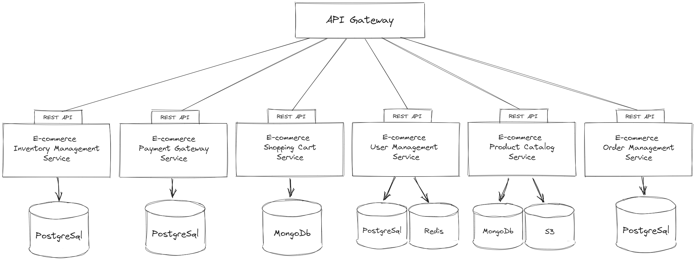

# Architecture
Architecture based on [requirements](./Requirements.md).

## Diagram

## Services

### Ecommerce User Management Service (EUMS)
This service is responsible for user registration, login, profile management, and authentication.

#### Communication
Communicates with other services via RESTful APIs or message queues for user-related actions and events.

#### Database 

| Database Type          | Explanation                                                                                             |
|------------------------|---------------------------------------------------------------------------------------------------------|
| SQL (e.g. PostgresSQL) | Storing user data, profiles, and authentication details often benefits from relational data structures. |
| NoSQL (e.g. Redis)     | Expiry mechanism (TTL) for user sessions and low latency.                                               |

### Ecommerce Product Catalog Service (EPCS)
Manages product information, including listings, descriptions, images, and pricing.

#### Communication
Communicates with the Inventory Management service for displaying products and updating stock.

#### Database

| Database Type            | Explanation                                                                           |
|--------------------------|---------------------------------------------------------------------------------------|
| NoSQL (e.g. MongoDB)     | Flexible schema for handling various product attributes and allowing for scalability. |
| Object Storage (e.g. S3) | Storing images with high data availability.                                           |

### Ecommerce Order Management Service (EOMS)
Manages the order lifecycle, including order creation, payment processing, order fulfillment, and tracking.

#### Communication
Communicates with User Management, and Payment Gateway services for order-related actions and updates.

#### Database

| Database Type          | Explanation                                                                                                                                |
|------------------------|--------------------------------------------------------------------------------------------------------------------------------------------|
| SQL (e.g. PostgresSQL) | Orders often have well-defined structures with relationships to users and products. SQL databases handle such structured data efficiently. |

### Ecommerce Payment Gateway Service (EPGS)
Handles payment processing, including payment methods, authorization, and transaction management.

#### Communication
Communicates with Order Management and User Management services for payment authorization and order completion.

#### Database

| Database Type          | Explanation                                                                                        |
|------------------------|----------------------------------------------------------------------------------------------------|
| SQL (e.g. PostgresSQL) | Transactional data like payments requires ACID compliance, making SQL databases a suitable choice. |

### *tobedone* Ecommerce Shopping Cart Service (ESCS)
Handles user shopping carts, including adding/removing items, calculating totals, and storing cart state.

#### Communication
Interacts with the User Management, Product Catalog, Inventory Management and Order Management services for cart actions and order placement.

#### Database

| Database Type        | Explanation                                                                                                                              |
|----------------------|------------------------------------------------------------------------------------------------------------------------------------------|
| NoSQL (e.g. MongoDB) | Cart data can be transient and often involves complex structures like nested items. NoSQL databases are suitable for handling such data. |

### *tobedone* Ecommerce Inventory Management Service (EIMS)
Manages product stock levels, tracks inventory, and updates the Product Catalog service with availability information.

#### Communication
Communicates with the User Management and Product Catalog services for real-time stock updates.

#### Database

| Database Type          | Explanation                                                                                                  |
|------------------------|--------------------------------------------------------------------------------------------------------------|
| SQL (e.g. PostgresSQL) | Inventory data often involves structured information like product quantities, making SQL databases suitable. |

